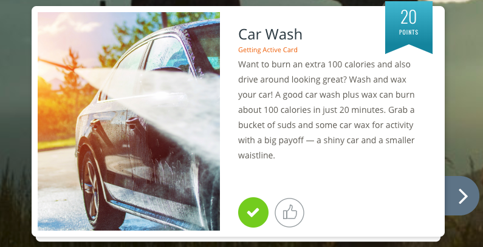

# Virgin Pulse Automator
## Automated wellness activity tracking with selenium
My company uses a service called [Virgin Pulse](https://www.virginpulse.com/) to provide wellness benefits. 
Virgin Pulse is a platform where users can log in and by making sure employees are constantly engaged my meticulously 
tracking their activities through the Virgin Pulse platform. With each activity tracked, you get points. 
Track enough activities consistently, and you accumulate enough points for rewards.

Personally, I have a strong dislike for this kind of intensive tracking. There are several reasons:
* I do not always want to wear a fitness tracking device and record every work out.
* Clicking buttons does not mean I am actually working out. 
* I spend way too much time figuring out how to "earn more points" when I have better things to do with my time.
* My life would be greatly improved if I could focus more on my workout routine than the number of steps I took while wearing my Garmin, 
and whether or not I "read" my "daily cards".

Daily cards are one of the main sources for points (besides submitting workouts). I do not find much value in them, and
only mindlessly click them in order to get points. Here is one I received today:

Thanks Virgin Pulse, but I am already well aware I can wash my car to burn calories. 
But that won't do much to give me a "smaller waistline".

I used to work out 20-30 hours a week in college as a rower. I refuse to ever consider walking a _workout_, let alone washing a car. 

## Project Goal
Automate enough points so that I can reach my maximum quarterly benefit without having to log into Virgin Pulse each day
and do some mindless clicking.

While I have previous experience with Python and Selenium, I would like to learn Docker to "containerize" this project.
My primary motivation is that I plan on deploying this project to the cloud, and so project portability is a primary concern. 
Given the libraries I intend to use for this project have operating system specific versions, it will be much simpler for me to
have my development environment match my production/cloud environment as closely as possible.

## Technologies Used
* Python 3 - Programming Language
* Selenium - Automate actions in the browser
* Docker - Container

## Implementation Roadmap
MVP
1. Set up: Docker environment with Python3 and Selenium
1. Log into virgin pulse via script
1. Automate "daily card" clicks
1. Set up a daily cronjob
1. Deploy to server
1. Hardening

Beyond MVP:
1. Automate more things:
    * "Healthy habits" points
    * Sleep Tracker
    * More?
2. Email Reports

## Setup
WIP
